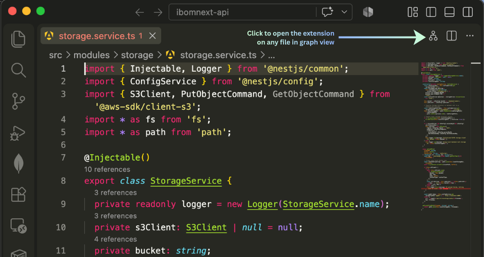
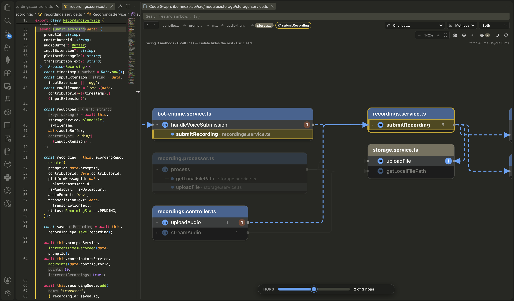

<p align="center">
  
</p>

# Code Graph View

> Navigate complex codebases visually as an interactive call graph. Trace execution paths, analyze git change blast radiuses, and curate high-signal context for AI assistants in one click.

[](https://marketplace.visualstudio.com/)
[](#how-it-works)
[](#how-it-works)

---





---

## Overview

Understanding non-trivial codebases by jumping through dozens of open editor tabs and running blind text searches is slow and error-prone. When explaining a bug, refactoring a service, or onboarding onto a new repository, developers need to see **how functions connect and pass data**.

**Code Graph View** turns your code into an intuitive visual topology:
- **Files are cards**, **methods are interactive rows**, and **lines are live calls**.
- Clicking any method highlights its upstream callers and downstream callees.
- **AI Context Curation**: Capture the exact execution path you are inspecting—complete with call hierarchy trees, method signatures, and deduplicated types—and hand it to **GitHub Copilot, Cursor, Claude Code, or ChatGPT** (pre-filled into VS Code Chat, or copied to your clipboard to paste).
- **Visual Git Blast Radius**: See exactly which symbols and downstream callers are impacted by staged, unstaged, branch, or commit changes before opening a pull request.

---

## Quick Start

1. **Open any code file** in a supported language (`.ts`, `.tsx`, `.js`, `.jsx`, `.py`, `.go`, `.rs`).
2. **Click the Code Graph icon** in the **top-right action bar of the file editor** (look for the hierarchy/nodes icon next to the Split Editor button). Hovering over it displays **`Code Graph: Open Graph for Active File`**.
3. *Alternatively*, press <kbd>Cmd</kbd>+<kbd>Shift</kbd>+<kbd>P</kbd> (or <kbd>Ctrl</kbd>+<kbd>Shift</kbd>+<kbd>P</kbd>) and type **`Code Graph: Open Graph for Active File`**.

---

## Core Capabilities

### 1. Interactive Call Hierarchy & Tracing
- **Live Upstream & Downstream Flow**: Click any method to illuminate who calls it (orange) and what it invokes (blue).
- **Multi-Hop Exploration**: Adjust the **Hops slider** to expand 1, 2, 3, or more levels deep across the architecture.
- **Fluid Keyboard Navigation**: Step into callees (<kbd>→</kbd> / <kbd>Enter</kbd>), step into callers (<kbd>←</kbd>), or cycle sibling methods (<kbd>↑</kbd> / <kbd>↓</kbd>).
- **Instant Re-Rooting**: Double-click any method or file to make it the center of your graph.

### 2. AI Context Curation & Export
AI assistants like Copilot, Cursor, and Claude Code cannot see your screen. Instead of pasting thousands of lines of raw source files or waiting for the model to guess the call chain:
- **Curate Execution Paths**: Click `+` on individual methods or click `+ Add Trace` to capture an entire multi-hop path.
- **Granular Detail Control**: Toggle each method between **Name**, **Sig** (inputs, return types, and decorators), or **Full** (complete implementation body).
- **Deduplicated Schemas**: Automatically extracts referenced TypeScript interfaces and data models once, eliminating redundant token usage.
- **Secrets masked**: Common credentials (API keys, tokens, private keys, passwords in URLs, quoted values on fields like `password` or `apiKey`) are replaced with `[REDACTED]` before you copy or send. On by default; see `codeGraphView.redactSecrets`.
- **Session-only**: The context lives in memory and is cleared when the workspace closes.
- **Send to chat**: Opens **VS Code Chat (Copilot)** pre-filled with the context. For **Cursor, Continue, Cline, Cody and Claude Code** the context is copied to your clipboard and, where the extension exposes a command, its chat panel is opened; paste to send. You can also copy prompt-ready markdown with one click.
- **Pre-Built & Custom Prompts**: Choose from *Explain this flow*, *Find bugs & edge cases*, *Generate unit tests*, or type custom instructions.

### 3. Git Impact & Blast Radius Analysis
- **Inspect Live Changes**: Filter the graph to show only methods touched by uncommitted edits, staged changes, PR branches (`HEAD vs main`), or recent commits. Clicking a changed method opens VS Code's before/after diff at that method.
- **Review a Change**: In the changes view a strip above the graph summarises the risk: changed methods, callers this change did not update, signature changes (TypeScript/JavaScript, working-tree diffs), modified methods with no test found reaching them, and removed methods something still seems to call. A red or orange bar marks the risky methods, **⚠ risky** filters to them, and the ‹ › stepper walks the changes riskiest first.
- **Review a Pull Request**: Run *Code Graph: Review a Pull Request* with a number or link. It checks the branch out (using the GitHub CLI when installed, otherwise GitHub's pull ref) and compares it with the PR's base.
- **Color-Coded Status**: Amber indicators mark modified methods; green indicators mark newly added symbols.
- **Callers Impact**: Immediately identify all upstream callers that could break from your modifications.

### 4. Live Signature & Type Inspector (`Alt+S`)
- Inspect parameter types, optional flags, default values, and decorators (`@Body()`, `@Param()`).
- View return types and referenced project type definitions side-by-side without leaving the graph.
- Click **Open in Editor** to jump directly to the exact source location.

### 5. Services Architecture Mode
- Switch between **Detailed Methods Mode** (fine-grained call graph) and **Services Mode** (file- and module-level dependencies with call counts).

---

## Keyboard Shortcuts

| Shortcut | Action |
|---|---|
| <kbd>→</kbd> / <kbd>Enter</kbd> | Step into callees (downstream flow) |
| <kbd>←</kbd> | Step into callers (upstream origin) |
| <kbd>↑</kbd> / <kbd>↓</kbd> | Step sibling methods in active file |
| <kbd>Space</kbd> | Open active method in editor beside graph |
| <kbd>F</kbd> | Center view on active method |
| <kbd>0</kbd> | Fit entire graph in view |
| <kbd>/</kbd> | Search files and symbols to re-root |
| <kbd>Alt</kbd> + <kbd>C</kbd> | Toggle AI Context panel |
| <kbd>Alt</kbd> + <kbd>S</kbd> | Toggle Signature Inspector |
| <kbd>Alt</kbd> + <kbd>←</kbd> / <kbd>→</kbd> | Navigate Back / Forward through history |
| <kbd>Esc</kbd> | Clear selection or exit isolate mode |

---

## Architecture & Design

- **Native Language Server Protocol**: Leverages VS Code's built-in LSP (Call Hierarchy, Document Symbols, Definitions, and Hover). No background daemons, external databases, or heavy local indexing required.
- **Deterministic Layout Engine**: Powered by ELK with persistent coordinate caching. The graph remains stable and predictable as you expand nodes.
- **Signature extraction**: `tsSignature.ts` is a small hand-written parser (TypeScript/JavaScript, plus a generic one for Go, Rust and Python) that reads parameters, generic bounds (`<T, R extends Base>`) and return types from the source, and fills in inferred types and doc comments from the language server's hover.
- **High-Performance SVG**: Custom SVG rendering pipeline with smooth pan, pinch-to-zoom, and responsive interaction.

---

## Requirements

The graph is built from your language server's **call hierarchy**, so each language needs an extension that provides it: TypeScript/JavaScript (built in), Go (gopls, via the Go extension), Rust (rust-analyzer) and Python (Pylance). The git changes view needs `git` on your PATH and a trusted workspace.

**What the review numbers mean.** Callers come from the call hierarchy, so calls through interfaces, callbacks, events, dependency injection or reflection are not seen: treat the counts as a minimum. "No test found" means no test-named file (`*.test.*`, `*.spec.*`, `__tests__`, `_test.go`, `test_*.py`) was found among the calls that reach a method, not that none exists. "Removed, still referenced" is a text search by name, so check each hit.

---

## Configuration

Settings can be customized in `settings.json`:

```json
{
  // Call hops fetched upfront when opening a method (1-8, default: 2)
  "codeGraphView.maxDepth": 2,

  // Hide test files (*.spec.ts, *.test.ts, __tests__) unless explicitly rooted (default: true)
  "codeGraphView.hideTests": true,

  // Include class constructors as graph nodes (default: false)
  "codeGraphView.includeConstructors": false,

  // Mask credentials in copied or sent AI context (default: true)
  "codeGraphView.redactSecrets": true
}
```

---

## Contributing & Development

For architecture diagrams, local environment setup, build commands, and testing guidelines, see **[DEVELOPMENT.md](DEVELOPMENT.md)**.

---

## License

MIT

